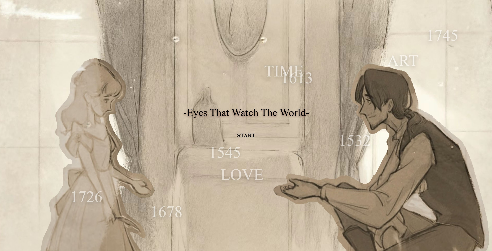
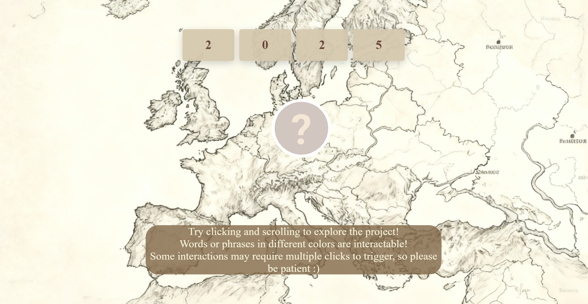

# Eyes that Watch the World -- by Aster
**The journey of an ever-aging painter pursuing the meaning of life and the understanding of others.**

This project takes the form of a website to create an interactive, movie-like viewing experience, portraying the long life of an artist. Through scrolling and clicking, viewers move across different years and locations, witnessing the artist’s growth, loss, and gain over time.

**[Go Explore the website!](https://aster1026.github.io/Comlab-Code/EyesThatWatchTheWorld/)**

**More details**

**About the story:** The ever-aging painter is able to visualize fragments of other people’s memories through his art. He drifts through countless lives, spending his extended lifespan painting them, until he finally meets a girl who also carries a unique dream of becoming a fiction novelist.

But can feelings truly survive across such a long stretch of time?

Do you still remember him?

Was he ever truly seen?

**The translation into the medium of the web:**

The original story was told in the form of storyboard-style animation. By translating it into a web-based format, the project allows viewers to interact with key moments in the narrative—such as clicking to trigger significant lines, or hovering to reveal shifting perspectives between two characters. Changes in location and time are also visually presented, offering additional details that expand the story world. Different chapters adopt slightly different interactive approaches, aiming to enrich the audience’s experience and their ways of engaging with the narrative.

**Key idea guiding this version:**

This project invites the audience to follow the artist’s path of growth and inner thoughts, exploring the story through different chapters and time periods. By personally triggering important moments, viewers are encouraged to immerse themselves more deeply in the narrative and gain a sense of control over it—almost as if they are writing or recording the story themselves.

**Some Screenshots:**

>The start page

>When and where is it now?

>A long, long time ago...

**[Want to explore more...?](https://aster1026.github.io/Comlab-Code/EyesThatWatchTheWorld/)**