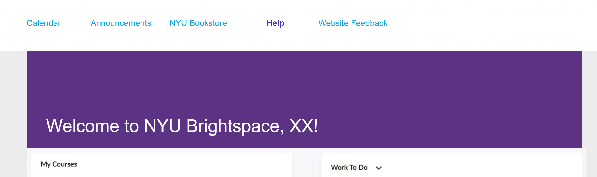
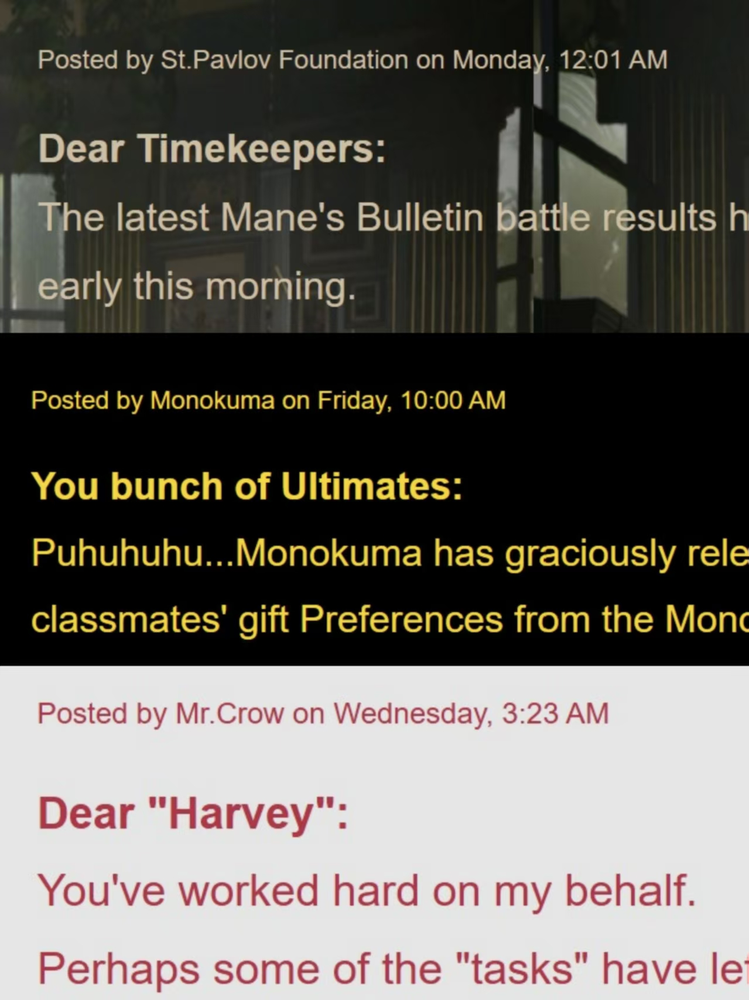

# UYN Gamespace?--by Aster
**——Too bored to go to school?**

**——We bring you a remix of a school learning site and a game management space!**

This is a **Fake** website that transforms your course and learning platform into a game hub! You can chat with other players, receive customized announcements, and check your game progress and unfinished missions — just like what a regular course site would do, but way more fun!

[Go Explore the website!](https://aster1026.github.io/Comlab-Code/ShanzhaiWebsite/)

**More details:**

I wanted to make this site because I thought it would be fun to make a school learning platform feel more like a game. What’s interesting is that game platforms like Steam actually share a lot in common with school websites — both have announcements, achievements (scores), and discussions between players or students.
So I figured combining these two could create a neat twist: at first, the audience might think, “Ugh, another school website…” but then — wait a second! Is this actually a game?

Unlike in school, where you’re always stuck as just a “student,” in games you can take on many different roles. That’s why this site also includes tailored announcements and titles depending on your in-game character.
If you’ve played the game before, you might find some familiar touches!

Since I didn’t have time to make this website fully complete, I added a few small story elements so the audience can more easily understand how to enjoy the project.
Have fun~

**Some Screenshots:**

>Just a normal university work website...?

>What happened? Hmmm...seems like some evil character is doing whatever he wants again...

>Hey...WHO are you playing right now??

[Want to explore more...?](https://aster1026.github.io/Comlab-Code/ShanzhaiWebsite/)